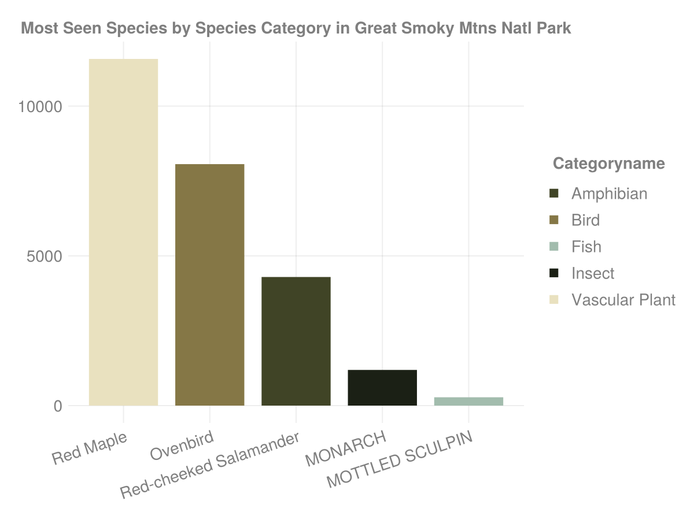
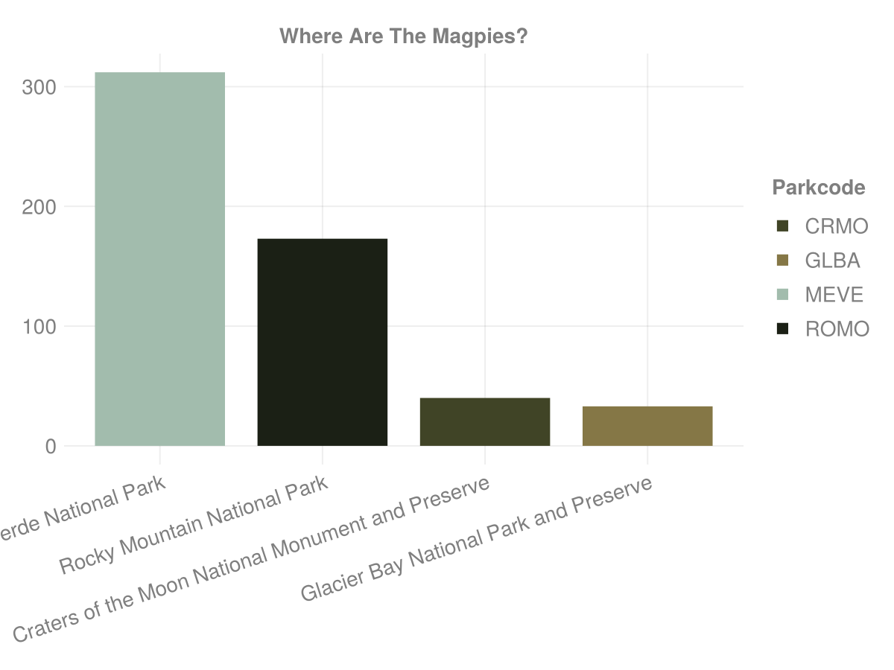
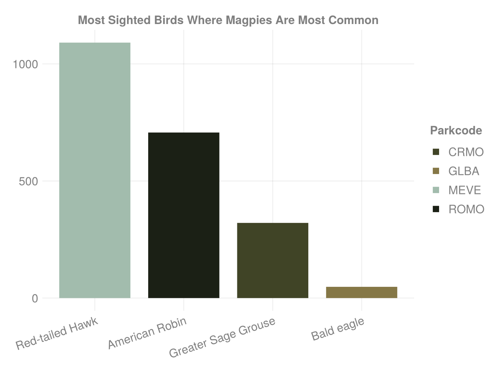
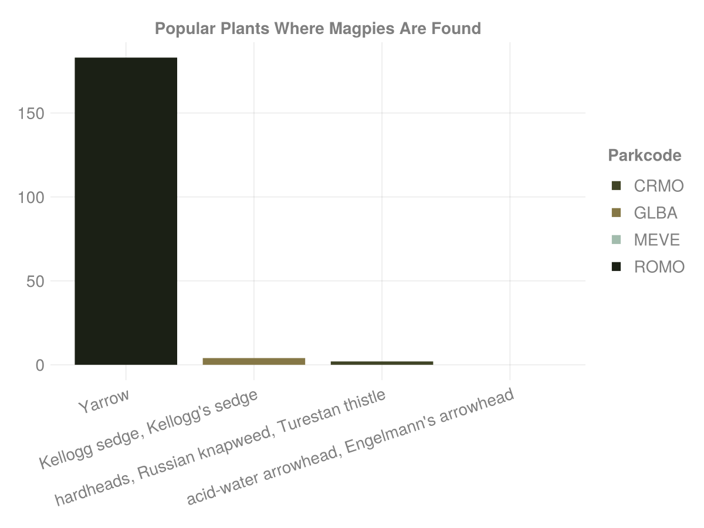
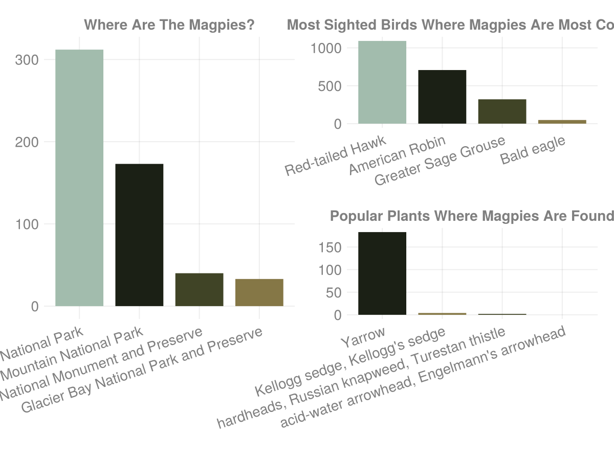

# NPSpecies.jl
frankiethull

# NPSpecies with Julia & Tidier :)

we are going to load the R library data directly into Julia for
exploratory analysis. We are reading the .rda file via the RData backend
of TidierFiles, then use TidierData and TidierPlots for most of the
examples. The dataset comes from National Park Service, it lists various
species found across parks in the USA.

## loading our data tools

the main pkgs are from TidierOrg, the tidyverse of Julia.

``` julia
using TidierFiles        # reading files, such as arrow, csv, xlsx, rdata, etc.
using TidierData         # dplyr  of julia
using TidierPlots        # ggplot of julia
using TidierStrings      # stringr of julia

using MarkdownTables     # a table pkg
using AlbumCoverColors   # github.com/frankiethull/AlbumCoverColors
using CodecBzip2         # to handle rda compression

TidierPlots.TidierPlots_set("plot_show", true)
TidierPlots.TidierPlots_set("plot_log",  false)

# get data from R pkg and do a tidy analysis in Julia: 
Base.download("https://github.com/frankiethull/NPSpecies/raw/main/data/species.rda", "species.rda")

# when you first read in rda, it is a dict, which contains the species data:
data = read_rdata("species.rda") 
data = DataFrame(data["species"]);
```

## exploratory analysis using TidierData

### Top Reptile in the Great Sand Dunes

let’s take a look at the top observed reptile in the Great Sand Dunes
National Park and Preserve:

``` julia
grsa_top_reptile =
@chain data begin
  @filter(ParkCode == "GRSA") 
  @filter(CategoryName == "Reptile")
  @select(ParkName, CategoryName, Family, SciName, CommonNames, Observations)
  @arrange(desc(Observations))
  @slice(1) 
end

grsa_top_reptile |> markdown_table()
```

| ParkName | CategoryName | Family | SciName | CommonNames | Observations |
|----|----|----|----|----|----|
| Great Sand Dunes National Park and Preserve | Reptile | Colubridae | Thamnophis elegans | Western Terrestrial Garter Snake | 11 |

alrighty, that’s pretty cool, we can explore any species, park, or
combination of other columns provided in the data frame. The code makes
sense and is pretty easy to read, especially coming from the R tidyverse
– should come natural if you know the polars in python syntax.

### top 5 non-native species in the Everglades

``` julia
top_nonnative_species_everglades = 
@chain data begin
  @filter(ParkCode == "EVER")
  @filter(Nativeness == "Non-native")
  @select(ParkName, CategoryName, Family, SciName, CommonNames, Observations)
  @arrange(desc(Observations))
  @slice(1:5) 
end

top_nonnative_species_everglades |> markdown_table()
```

| ParkName | CategoryName | Family | SciName | CommonNames | Observations |
|----|----|----|----|----|----|
| Everglades National Park | Reptile | Dactyloidae | Anolis sagrei | Brown Anole, Cuban Brown Anole | 99 |
| Everglades National Park | Amphibian | Hylidae | Osteopilus septentrionalis | Cuban Treefrog | 45 |
| Everglades National Park | Amphibian | Eleutherodactylidae | Eleutherodactylus planirostris | Greenhouse Frog | 11 |
| Everglades National Park | Reptile | Gekkonidae | Hemidactylus mabouia | Afroamerican house gecko, Afro-American House Gecko, Cosmopolitan House Gecko, Wood Slave | 6 |
| Everglades National Park | Reptile | Gekkonidae | Hemidactylus garnotii | Fox Gecko, Indopacific Gecko, Indo-Pacific Gecko, Indo-Pacific House Gecko | 1 |

### most observed bird species by park:

only displaying the top 10 across all most observed birds by park:

``` julia
most_observed_bird_by_park = 
@chain data begin
  @filter(CategoryName == "Bird")
  @group_by(ParkName)
  @select(ParkName, CommonNames, Observations)
  @arrange(desc(Observations))
  @slice(1)
  @ungroup()
  @arrange(desc(Observations)) 
end

# showing the most observed bird by park, 
# filtering to the 10 most seen in total
@chain most_observed_bird_by_park begin 
  @slice(1:10)
   markdown_table()
end
```

| ParkName | CommonNames | Observations |
|----|----|----|
| Great Smoky Mountains National Park | Ovenbird | 8063 |
| Saguaro National Park | cactus wren | 2780 |
| Sequoia and Kings Canyon National Parks | Dark-eyed Junco | 2543 |
| Casa Grande Ruins National Monument | Mourning Dove, WESTERN MOURNING DOVE | 1555 |
| Yosemite National Park | Oregon junco | 1422 |
| Valley Forge National Historical Park | American robin | 1308 |
| Mesa Verde National Park | Red-tailed Hawk | 1091 |
| Mount Rainier National Park | Marbled Murrelet | 1046 |
| Kenai Fjords National Park | Hermit thrush | 890 |
| Fredericksburg and Spotsylvania County Battlefields Memorial National Military Park | tufted titmouse | 827 |

okay those were some simple slicing and dicing, but what about graphics?
well TidierPlots has us covered.

## graphics with TidierPlots

### most observed species by species type in the smokies

Let’s take a look at the top species by species category, then sort for
the 5 most seen across all categories.

``` julia
most_observed_species_in_the_smokies = 
@chain data begin
  @filter(ParkCode == "GRSM")
  @select(ParkName, CommonNames, CategoryName, Observations)
  @group_by(CategoryName)
  @arrange(desc(Observations)) 
  @slice(1)    # top species by species category
  @ungroup()
  @arrange(desc(Observations))
  @slice(1:5) # top seen species
end

# creating a ggplot from TidierPlots ux and syntax almost identical to R's ggplot2
ggplot(most_observed_species_in_the_smokies, xticklabelrotation = .317) +
 geom_col(aes(x = cat_inorder(:CommonNames), y = :Observations, color = :CategoryName)) +
 labs(title = "Most Seen Species by Species Category in Great Smoky Mtns Natl Park") +
 scale_color_discrete(palette = AlbumCoverColors.fleetfoxes) +
 theme_light()
```



### Where are the Magpies?

Let’s see where magpies are commonly observed. We’re going to use
TidierStrings, because magpie is mentioned in different formats,
“american black-billed magpie”, “black-billed magpie”, “Magpie”, etc. we
will look for any common name that includes “magpie”.

#### Most Likely Places to See A Magpie (?)

``` julia
# most common parks to see a magpie (?) --------- 
magpies = 
@chain data begin
  @filter(str_detect(CommonNames, "magpie|Magpie"))
  @arrange(desc(Observations)) 
  @slice(1:4)    # top 4 parks
end

gg_magpies = 
ggplot(magpies, xticklabelrotation = .317) +
 geom_col(aes(x = cat_inorder(:ParkName), y = :Observations, color = :ParkCode)) +
 scale_color_discrete(palette = AlbumCoverColors.fleetfoxes) +
 labs(title = "Where Are The Magpies?") +
 theme_light() 
```



#### What Other Birds Co-Exist With Magpies (?)

Let’s drill down further into those Parks and see what other birds have
high Observations.

``` julia
other_birds = 
@chain data begin
  @filter(ParkCode in ("MEVE", "ROMO", "CRMO", "GLBA"))
  @filter(CategoryName == "Bird")
  @group_by(ParkName) 
  @arrange(desc(Observations))
  @slice(1)
  @ungroup()
end

gg_other_birds =
ggplot(other_birds, xticklabelrotation = .317) +
 geom_col(aes(x = cat_inorder(:CommonNames), y = :Observations, color = :ParkCode)) +
 labs(title = "Most Sighted Birds Where Magpies Are Most Common") +
 scale_color_discrete(palette = AlbumCoverColors.fleetfoxes) +
 theme_light()
```



#### Plants Among Magpies

Let’s see what kind of plants are observed across the parks as well.

``` julia
plants = 
@chain data begin
  @filter(ParkCode in ("MEVE", "ROMO", "CRMO", "GLBA"))
  @filter(CategoryName == "Vascular Plant")
  @group_by(ParkName) 
  @arrange(desc(Observations))
  @slice(1)
  @ungroup()
end

gg_plants =
ggplot(plants, xticklabelrotation = .317) +
 geom_col(aes(x = cat_inorder(:CommonNames), y = :Observations, color = :ParkCode)) +
 labs(title = "Popular Plants Where Magpies Are Found") +
 scale_color_discrete(palette = AlbumCoverColors.fleetfoxes) +
 theme_light()
```



##### Patchworking

TidierPlots also has a built-in chart arrangement method. It will be
familiar for those who have discovered the patchwork library in R.

``` julia
TidierPlots.TidierPlots_set("plot_show", true)
# dashboard output ----------
patch = gg_magpies + (gg_other_birds / gg_plants)

patch
```



##### citation

NPSpecies - The National Park Service biodiversity database.
https://irma.nps.gov/npspecies/ Accessed September 2nd, 2024
